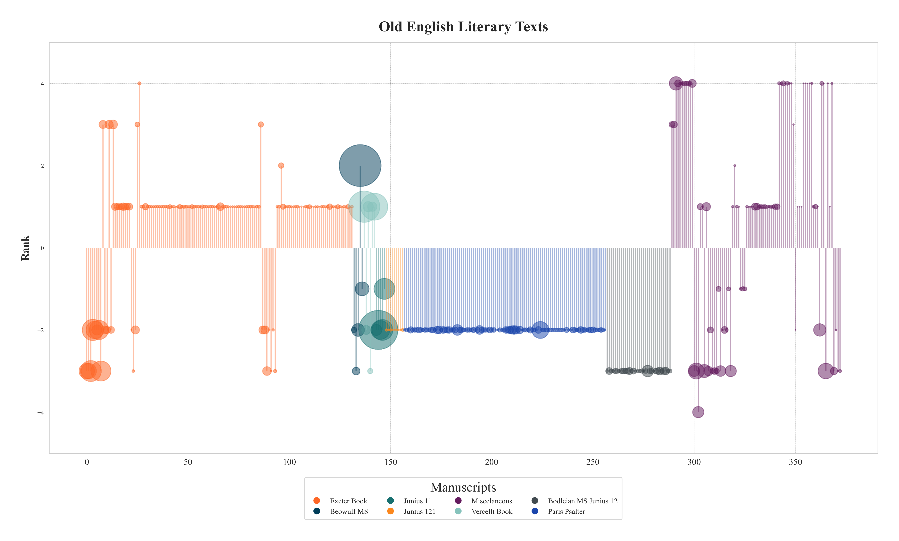

# Old English Overview
**by Daniel Barrera**
*2024-12-08*

Data vizualization and NLP at the service of literature: What if we could see in an instant the main trends, origin, and exteansion of every literary text written in Old English?

## Visualizing Literature

lollipop, bubble plots.

### All the manuscripts

  *A brief description of the topic.*

- [All the manuscripts](#)  